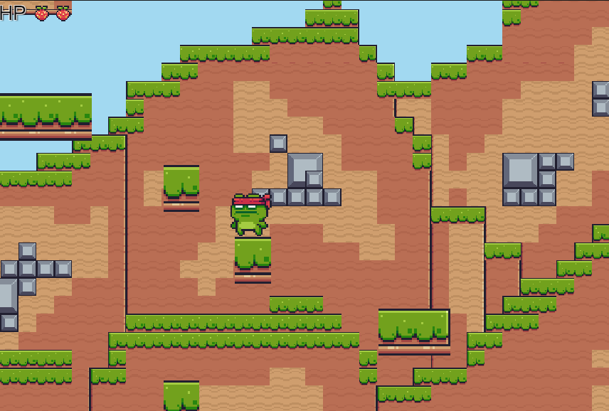
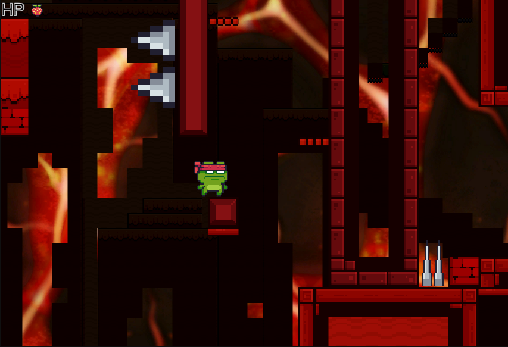

# 🐸 Frog Adventure

## 🎮 Overview

**Frog Adventure**는 Unity 2D 기반으로 제작된 **스테이지형 액션 퍼즐 플랫폼 게임**입니다.  
플레이어는 귀여운 개구리를 조작해 다양한 장애물과 적을 피해 **3개의 스테이지를 클리어**해야 합니다.  
단순하지만 정교한 충돌 설계, 점점 어려워지는 난이도, 탄탄한 구조의 카메라 시스템을 통해  
한 프레임 한 프레임 공들여 제작했습니다.

---

## 🧩 게임 구성

- **총 3개의 Scene (Stage 1, 2, 3)**  
  각 스테이지는 Checkpoint 시스템으로 설계되어, 도달 시 다음 구간으로 자연스럽게 이어집니다.

- ***1단계***

- 

- ***2단계***

- 

- ***3단계***

- 

- **카메라 시스템**  
  캐릭터의 이동 방향을 따라가는 부드러운 카메라 트래킹으로 몰입감 극대화.

- **체력 시스템**
  - 총 **2개의 생명(HP)**  
  - 장애물이나 적에 충돌 시 1씩 감소  
  - 체력 0이 되면 **Retry 버튼**이 활성화되어 해당 스테이지 재도전  
  - **낙사 시 1스테이지로 자동 복귀**

- **스테이지별 난이도 조절**
  - **Stage 1:** 기초 이동 및 충돌 학습  
  - **Stage 2:** 움직이는 적 등장, 점프 타이밍 요구  
  - **Stage 3:** 고난이도 장애물, 좁은 플랫폼, 심리적 압박 요소

- **게임 클리어 연출**
  - 최종 스테이지 도달 시 “**Game Clear**” 텍스트와 함께  
    **개구리의 점프 환호 애니메이션**이 재생되며 마무리

---

## 🧠 게임 설계 철학

> **"한 번의 실수가 곧 도전의 시작"**

- 충돌 = 체력 감소, 낙사 = 처음부터  
  단순한 룰을 바탕으로도 생각할 거리를 주는 스테이지 디자인

- **부딪힘을 '학습 요소'로 사용**  
  부딪힘이 단순한 실패가 아닌 **도전의 피드백**이 되도록 유도

- **'적절한 좌절감'과 '극복의 쾌감'의 밸런스**  
  반복되는 트라이앤에러 속에 **패턴을 파악하고**  
  점점 **스테이지를 정복해나가는 성장 경험**을 제공합니다.

---

## 🛠️ 개발 기술 스택

| 항목 | 설명 |
|------|------|
| Engine | Unity 2D |
| Language | C# |
| 시스템 | 씬 전환, 체력 관리, 충돌 처리, 카메라 트래킹, UI 인터랙션 |
| 애니메이션 | 개구리 점프, 환호, 부딪힘 애니메이션 구현 |
| UI 구성 | HP 바, Retry 버튼, Game Clear 텍스트 등 직관적 UI |
| 레벨 설계 | 스테이지별 기믹/적 배치, Checkpoint 기반 레벨 구성 |

---

## 🔥 한 줄 요약

> **단순함 속의 정교함, 귀여움 속의 난이도. Frog Adventure는 플레이어를 한 단계 성장시키는 플랫폼 챌린지입니다.**

---

