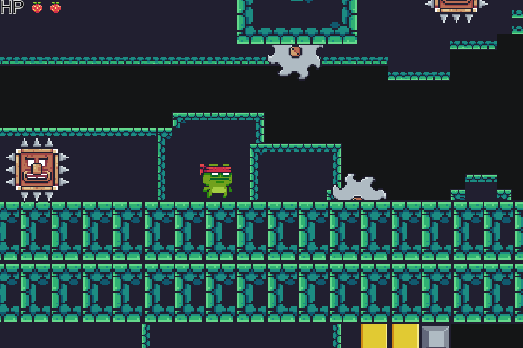

# 🐸 Frog Adventure

## 🎮 Overview

**Frog Adventure**는 Unity 2D 기반으로 제작된 **스테이지형 액션 퍼즐 플랫폼 게임**입니다.  
플레이어는 귀여운 개구리를 조작해 다양한 장애물과 적을 피해 **3개의 스테이지를 클리어**해야 합니다.  
단순하지만 정교한 충돌 설계, 점점 어려워지는 난이도, 탄탄한 구조의 카메라 시스템을 통해  
한 프레임 한 프레임 공들여 제작했습니다.

---

## 🧩 게임 구성

- **총 3개의 Scene (Stage 1, 2, 3)**  
  각 스테이지는 Checkpoint 시스템으로 설계되어, 도달 시 다음 구간으로 자연스럽게 이어집니다.

-  ***1단계***

  

- ***2단계***

- ***3단계***

 

- **카메라 시스템**  
  캐릭터의 이동 방향을 따라가는 부드러운 카메라 트래킹으로 몰입감 극대화.

- **체력 시스템**
  - 총 **2개의 생명(HP)**  
  - 장애물이나 적에 충돌 시 1씩 감소  
  - 체력 0이 되면 **Retry 버튼**이 활성화되어 해당 스테이지 재도전  
  - **낙사 시 1스테이지로 자동 복귀**

- **스테이지별 난이도 조절**
  - **Stage 1:** 기초 이동 및 충돌 학습  
  - **Stage 2:** **움직이는 적** 등장, 점프 타이밍 요구  
  - **Stage 3:** **고난이도 장애물**,**움직이는 적 등장**, 좁은 플랫폼, 심리적 압박 요소

- **게임 클리어 연출**
  - 최종 스테이지 도달 시 “**Game Clear**” 텍스트와 함께  
    **개구리의 점프 환호 애니메이션**이 재생되며 마무리

---

## 게임 설계 

> 
- 충돌 = 체력 감소, 낙사 = 처음부터  
  단순한 룰을 바탕으로도 생각할 거리를 주는 스테이지 디자인

- **부딪힘을 '학습 요소'로 사용**  
  부딪힘이 단순한 실패가 아닌 **도전의 피드백**이 되도록 유도

- **'적절한 좌절감'과 '극복의 쾌감'의 밸런스**  
  반복되는 트라이앤에러 속에 **패턴을 파악하고**  
  점점 **스테이지를 정복해나가는 성장 경험**을 제공합니다.

---

## 개발 기술 스택

| 항목 | 설명 |
|------|------|
| Engine | Unity 2D |
| Language | C# |
| 시스템 | 씬 전환, 체력 관리, 충돌 처리, 카메라 트래킹, UI 인터랙션 |
| 애니메이션 | 개구리 점프, 환호, 부딪힘 애니메이션 구현 |
| UI 구성 | HP 바, Retry 버튼, Game Clear 텍스트 등 직관적 UI |
| 레벨 설계 | 스테이지별 기믹/적 배치, Checkpoint 기반 레벨 구성 |

---
| 기술 스택                               | 설명                                             |
| ----------------------------------- | ---------------------------------------------- |
| **Unity**                           | 게임 전체 제작에 사용된 엔진 (2021.3.x 버전 기반)              |
| **C#**                              | 게임 로직, 충돌 처리, 카메라 이동, UI 제어 등 주요 스크립트 작성에 사용   |
| **Unity 2D Physics**                | 점프, 낙사, 충돌 판정 및 피격/사망 처리 등 물리 기반 시스템 구현        |
| **Cinemachine**                     | 플레이어 이동에 따라 카메라를 자연스럽게 따라오게 설정                 |
| **TextMeshPro**                     | Checkpoint, Game Over, Clear 등 메시지 및 UI 텍스트 표현 |
| **Git & GitHub**                    | 버전 관리 및 프로젝트 협업 및 배포용 저장소 관리에 사용               |
| **Photoshop** / **Pixel Art Tools** | 배경, 스프라이트, UI 요소 디자인 작업에 사용 (필요시 삽입)           |
---

| 스크립트 이름               | 설명                                         |
| --------------------- | ------------------------------------------ |
| `Camera_Follow.cs`    | 플레이어의 이동을 따라 자연스럽게 카메라가 움직이도록 처리           |
| `FallTrigger.cs`      | 낙사 지점에 도달하면 플레이어를 첫 번째 스테이지로 리셋            |
| `GameClearEffects.cs` | 마지막 스테이지 도달 시 캐릭터의 점프 애니메이션 및 게임 클리어 연출 처리 |
| `MiniMapFollow.cs`    | 미니맵이 플레이어 위치에 맞춰 따라오도록 구현                  |
| `Player.cs`           | 이동, 점프, 체력 관리, 피격 처리 등 핵심 컨트롤러 스크립트        |
| `SawMovements.cs`     | 톱니바퀴형 장애물의 반복적인 움직임 처리                     |
| `SceneChanger.cs`     | 각 체크포인트 도달 시 다음 스테이지(씬)으로 전환               |
| `SpikeHead.cs`        | 특정 위치에서 위/아래로 반복적으로 움직이는 장애물 제어            |

